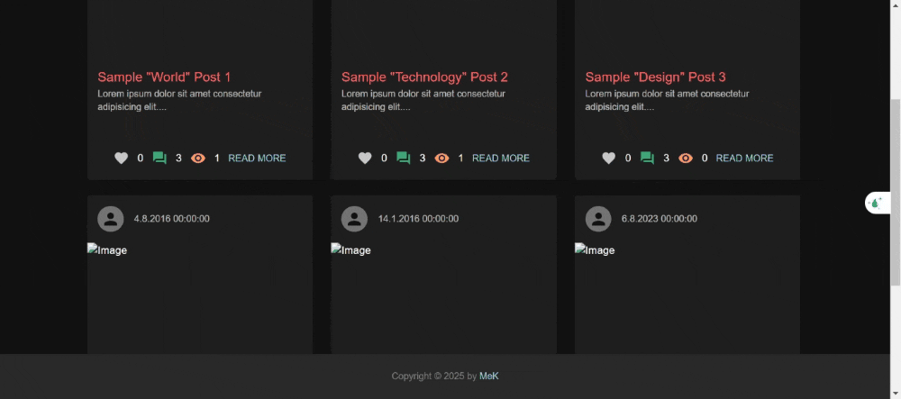

## Blog App Frontend
Die Blog App ist eine moderne Webanwendung, mit der Nutzer Blogs erstellen, liken und kommentieren können. Die App ist responsiv gestaltet und bietet eine einfache sowie intuitive Benutzererfahrung.

## Features
Blogs anzeigen, erstellen, löschen und bearbeiten
Beiträge liken und Kommentare hinzufügen
Pagination für eine bessere Übersicht
Moderne UI mit Material-UI
State-Management mit Redux Toolkit

## Technologien
React
Redux Toolkit
Material-UI
Axios
## 1. Repository klonen
git clone https://github.com/muzafferkocak/milestone-blog-app.git  
cd milestone-blog-app

## 2. Abhängigkeiten installieren
npm install 

## 3. Starten
npm start

